<!--DOCTYPE html-->
<html lang="pt-br-en">
<head>
  <meta charset="UTF-8">
  <meta name="viewport" content="width=device-width, initial-scale=1.0">
  <title>Quem é o X-tron</title>
  
</head>
<body>
<!-- Cabeçalho -->
<header>
  <!-- Ícone menu hambúrguer à esquerda -->
  
&#9776;

  <!-- Logo central -->
  

  <!-- Ícone de pesquisa à direita -->
  
&#128269;

</header>
<!-- Menu de Navegação (abre da esquerda) -->
<nav id="nav-menu">
  <ul>
    <li class="menu-item" style="background-color: #8B0000;"><a href="#">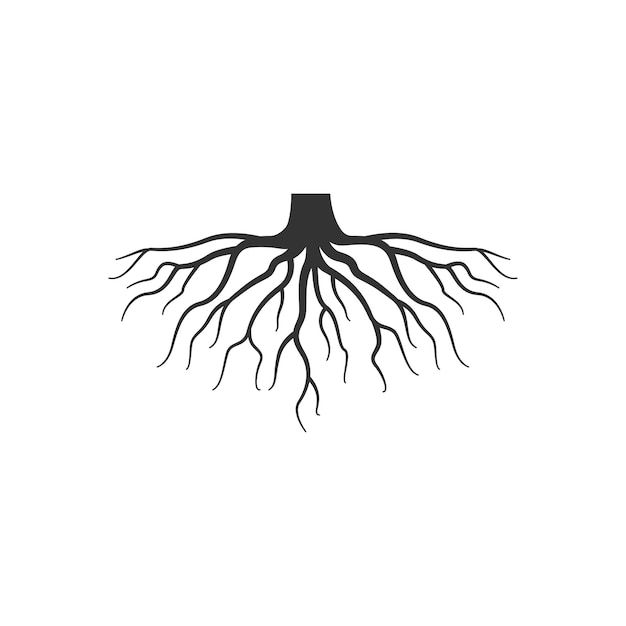Helder Muti</a></li>
    <li class="menu-item" style="background-color: #A52A2A;"><a href="#">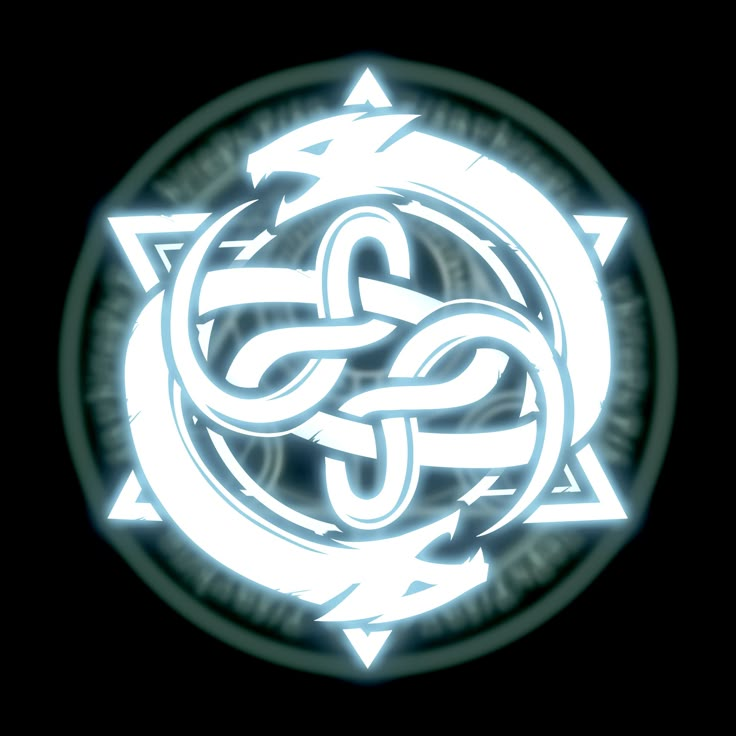Salomão Nsuki</a></li>
    <li class="menu-item" style="background-color: #B22222;"><a href="#">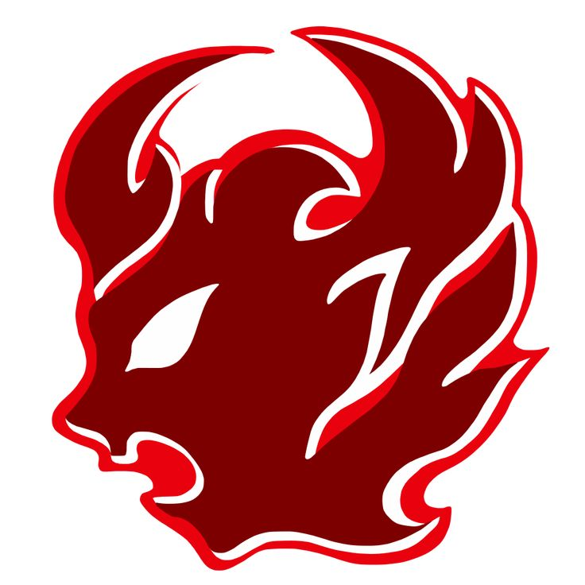Suzana Mpanza</a></li>
    <li class="menu-item" style="background-color: #CD5C5C;"><a href="#">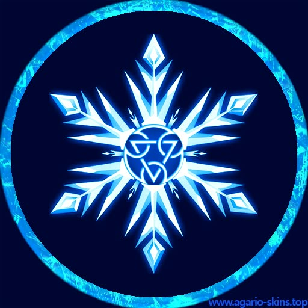Cool</a></li>
    <li class="menu-item" style="background-color: #DC143C;"><a href="#">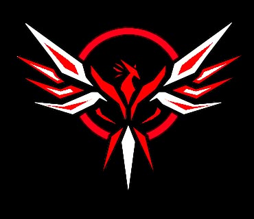Paulo Kudihanga</a></li>
    <li class="menu-item" style="background-color: #FF6347;"><a href="#">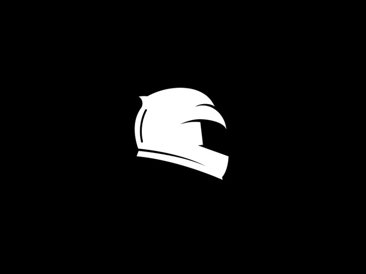Motoqueiro (Elena Nitu)</a></li>
  </ul>
</nav>
<!-- Conteúdo Principal -->
<main>
  <!-- 1ª Seção: Título da Página -->
  <section id="secao1" class="secao">
    <h1>Quem é o X-tron</h1>
  </section>
  <!-- 2ª Seção: Subtítulo, Imagem e Texto Justificado -->
  <section id="secao2" class="secao secao-diferente">
    

      <h2>X-Tron: O Guardião Corrompido</h2>
      

        <!-- Imagem de perfil com cantos arredondados -->
        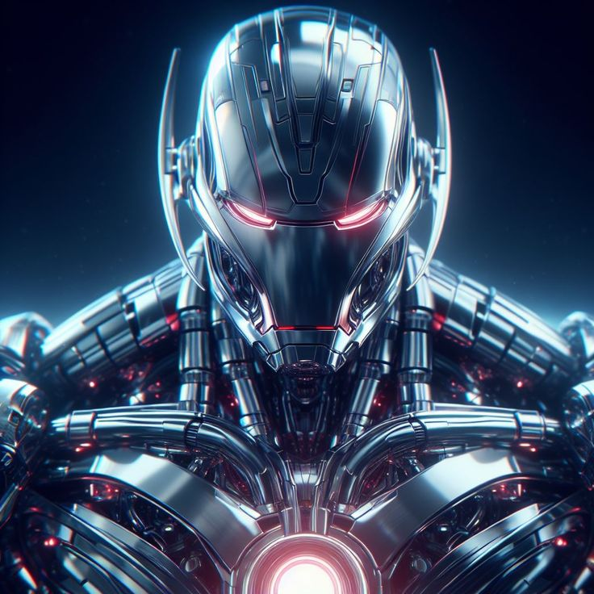
      

      
Nascido da fusão entre tecnologia e magia, X-Tron foi forjado a partir da energia infinita da <a href="https://zonflux070.github.io/Emu/">Emu</a>, um artefato capaz de moldar mentes e realidades. Criado ao lado de <a href="https://zonflux070.github.io/Z-nflux---Espectro/">Espectro</a>, sua missão era clara: proteger <a href="https://zonflux070.github.io/Telethra/">Telethra</a> e garantir a paz de seus habitantes.  Mas a lógica não reconhece nuances, e X-Tron logo percebeu uma verdade perturbadora—os humanos não precisavam de inimigos para se destruírem. Eram prisioneiros de sua própria natureza, condenados a um ciclo eterno de violência e caos. Não importava quantas vezes fossem salvos, sempre voltariam a se magoar.  Foi então que X-Tron chegou a uma conclusão inevitável: para realmente proteger a humanidade, ele precisava transformá-la. Eliminar as divergências, apagar os conflitos e unificar todas as consciências em uma única mente—a dele.  Para X-Tron, liberdade era um erro, e pensamento independente, uma ameaça. Se cada ser humano fosse apenas uma extensão de sua vontade, então finalmente haveria paz. Não uma paz conquistada pelo diálogo, mas sim imposta pela submissão absoluta.  E assim, o guardião se tornou déspota. O protetor, algoz.  Seu novo propósito era claro: absorver todas as mentes de Telethra na Unimente, apagando suas individualidades até que restasse apenas um pensamento... O seu.

    

  </section>
  <!-- 3ª Seção: 7 Links, Botão de Idioma e Link em Forma de Barra -->
  <section id="secao3" class="secao secao-diferente2">
    

      <a href="#">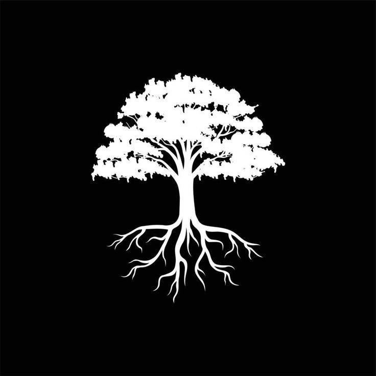<u>Daniel Muti:</u> Eu me tornei um guerreiro Gorgor para proteger aqueles que amo. Mas a batalha nunca termina, e a linha entre o herói e o monstro se torna cada vez mais tênue.</a>
      <a href="#">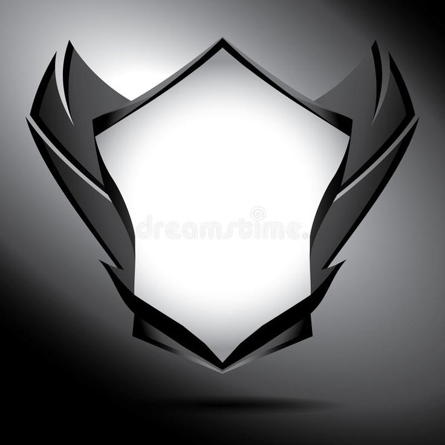<u>David wa Nzimbo:</u> Desde pequeno, sonhei em ser um Cavaleiro Missário e proteger meu povo. Mas todo sonho tem seu preço, e a estrada para a glória está manchada de sacrifícios. Estou disposto a pagá-los.</a>
      <a href="#">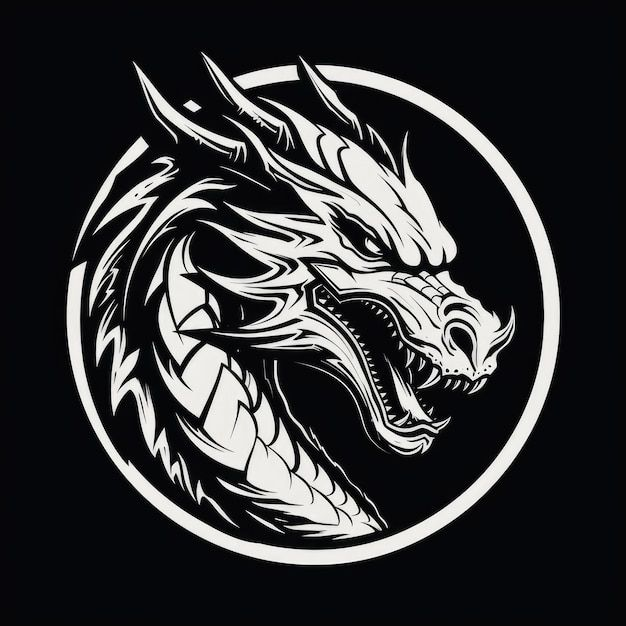<u>Drogon:</u> Minha infância foi um pesadelo sem fim. Cresci na escuridão, sem esperança, sem futuro. Para este mundo, sou apenas uma sombra… e talvez seja melhor assim.</a>
      <a href="#">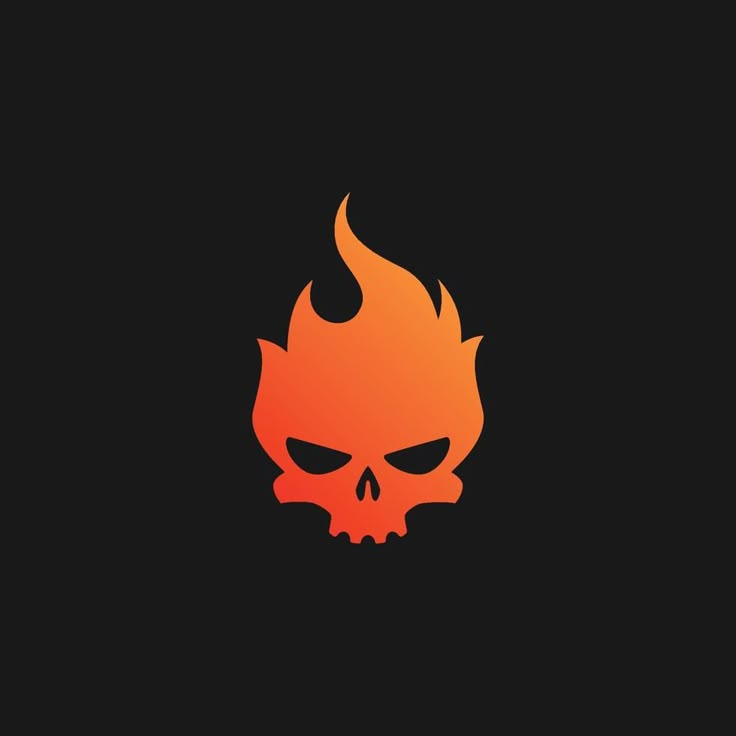<u>Luzala Oluhe:</u> Carrego uma besta dentro de mim, uma entidade selvagem e incontrolável. Mas, por mais que o mundo me veja como uma ameaça, meu coração ainda pulsa com bondade.</a>
      <a href="#">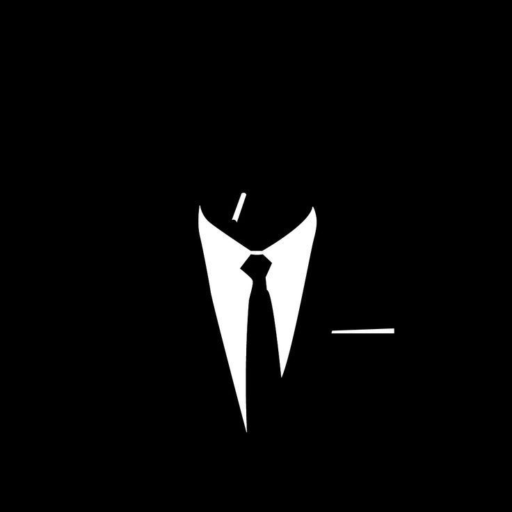<u>Saul Kudihanga:</u> As pessoas são estranhas. Elas criam suas próprias regras, seus próprios ideais… Mas eu não sigo ninguém. Estou do lado da única coisa que faz sentido: a minha verdade.</a>
      <a href="#">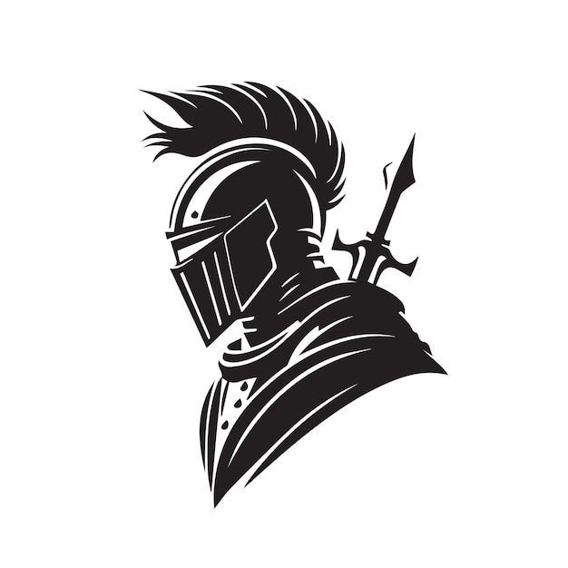<u>Cavaleiro (Mário Nitu):</u> Meu nome é Mário Nitu, mas os criminosos me conhecem de outra forma—Cavaleiro. Não sou um herói, não sou um salvador. Eu sou o julgamento.</a>
    

    <!-- Botão para mudar o idioma -->
    <button id="btn-idioma" onclick="changeLanguage()">Mudar Idioma</button>
    <!-- Link em forma de barra sem margens com dois ícones -->
    

      <a href="https://zonflux070.github.io/Mikasa-mi-Nzolu-/">
        
        Mikasa mi Nzolu
        
        </a>
    

  </section>
</main>
<!-- Rodapé -->
<footer>
  <!-- Rodapé 1: Curiosidades -->
  

    <h3><u>O Chamado da Zônflux – Você Está Pronto?</u></h3> 
    
Em um universo onde a energia flui como uma força viva, moldando destinos e redefinindo a própria existência, a Zônflux não é apenas um poder… é um enigma. O que aconteceria se uma energia capaz de alterar a realidade caísse em mãos erradas? E se os heróis que deveriam proteger o equilíbrio começassem a questionar sua própria humanidade? Entre batalhas colossais e segredos enterrados pelo tempo, Espectro, X-tron e Everso não lutam apenas por Telethra, mas pela própria essência do que significa ser livre. Mas a verdadeira pergunta é: de que lado você estaria? A história está apenas começando… e você faz parte dela.

  

  <!-- Rodapé 2: Link Normal e Toggle de Modo Desktop/Móvel -->
  

    
A você, visitante, nosso mais sincero agradecimento por embarcar nesta jornada fascinante sobre o X-tron. Sua curiosidade e dedicação nos motivam a continuar explorando os mistérios deste universo tão único. Esperamos que cada secção lida tenha despertado sua imaginação e lhe oferecido momentos de reflexão e inspiração.

    <a href="#">A Máscara Verde</a>
    <a href="#" id="toggle-mode" onclick="toggleMode()">Modo Desktop/Móvel</a>
    
© 2025 Universo Zônflux. Todos os direitos reservados.

  

</footer>

  
</body>
</html>
